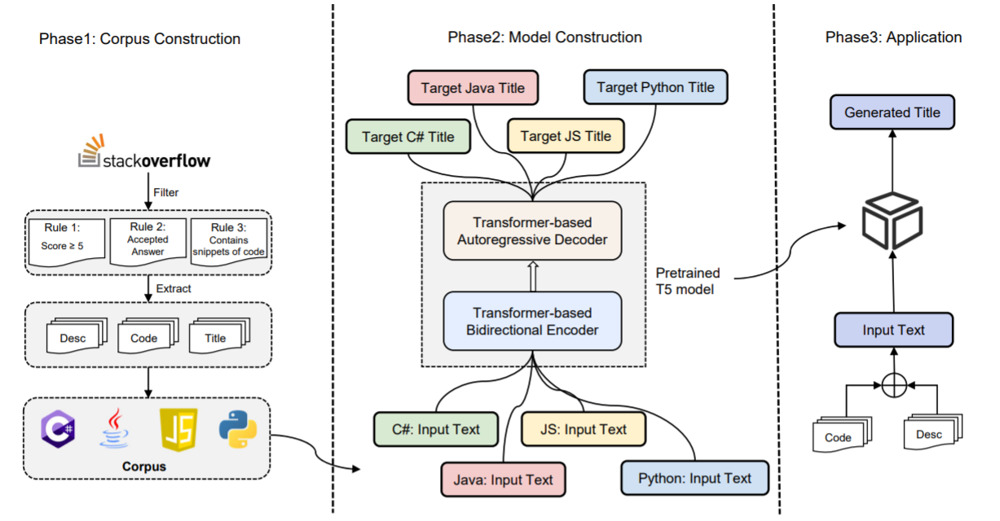

The source code and dataset for "SOTitle: A Transformer-based Post Title Generation Approach for Stack Overflow"

Our pretrained model has released on huggingface. https://huggingface.co/NTUYG/SOTitle-Gen-T5

## How to train

just modify the settings and run train.py

when we train, we fouce the 'Rouge-L' implemented by 'nlg-eval'(https://github.com/Maluuba/nlg-eval)

when we evaluate, we use the 'rouge'(https://github.com/pltrdy/rouge) to compute the 'Recall' in the Rouge-1, Rouge-2, and Rouge-L

## How to use

the demo can be found in gen.py

